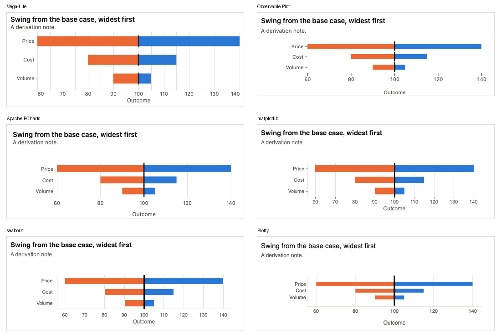

# chart-atlas

**Look at the data, work out what is worth saying, and show it with the chart that says it honestly.**

chart-atlas is a chart *recommender* with a chart library underneath it. Give it a
table of rows; it profiles the columns, proposes ranked candidate views (revenue by
region, revenue over time, a relationship between two measures, ...), finds what is
notable in each (concentration, a trend, a cycle, a correlation, outliers), and picks
the chart that fits, with the reasons, the alternatives it rejected, and the caveats
a careful analyst would attach. The charts it chooses from are native-SVG components
sharing one theme and one mark-spec, so a page built from several of them reads as
one design system.

> **Status: early and moving.** The chart library, the chart catalog, the data
> profiler, a rendering-honesty audit and a first version of the recommender are
> built and tested. Turning a recommendation into a rendered chart, and the Claude
> skill that writes the prose, come next. Nothing is published to npm yet. See
> [Status](#status).

## How it works

```
rows ─► 1. PROFILE ─► 2. FRAME ─► 3. RECOMMEND ─► 4. JUSTIFY ─► 5. RENDER
        code          insight     code + catalog  rationale     chart-atlas SVG
```

1. **Profile** (deterministic code, `src/profile/`). Classifies each column
   (quantitative, ordinal, nominal, temporal, id), then enumerates and ranks
   candidate *views* of the data with their structure (time series, part-to-whole,
   ranges, targets), findings and caveats. Output is plain JSON.
2. **Frame the insight.** Pick the one claim worth making from the findings.
3. **Recommend** (`src/catalog/` + rules). Each chart declares what it is for, what
   data it needs and when *not* to use it. Rules filter and score the candidates.
4. **Justify.** State why this chart, why not the others, and what to be careful of.
   The answer may be "a table" or "a single number" when the data is too small to
   deserve a chart.
5. **Render** with the existing chart factories.

Rules come in three tiers: **integrity** rules (a chart must not say something false)
are hard filters; **default** rules are followed unless the context justifies an
override, which is then stated; **taste** only breaks ties. Every recommendation
carries its caveats, for example that a trend over time is not an explanation or that
rows were aggregated.

The design contract, the insight taxonomy (17 types) and the rule set (R1-R40) are in
[docs/insight-taxonomy.md](./docs/insight-taxonomy.md).

## Try the profiler

```ts
import { profileDataset } from "chart-atlas";

const profile = profileDataset(rows, { pin: ["revenue"], maxViews: 5 });

for (const v of profile.views) {
  console.log(v.score, v.kind, v.columns, v.structure);
  console.log(v.findings.map((f) => f.text));   // e.g. "The top 2 of 9 categories account for 80% of the total"
  console.log(v.caveats.map((c) => c.text));    // e.g. "36 rows were combined into 3 categories by summing revenue"
}
```

`rows` is an array of plain objects. Numbers may be strings (`"$1,200"`, `"45%"`),
dates may be ISO strings, and missing values (`null`, `""`, `NA`) are handled.

## Ask for a recommendation

```ts
import { profileDataset, recommend } from "chart-atlas";

const [r] = recommend(profileDataset(rows), { purpose: "explain", audience: "executive" }, { top: 1 });

r.answer;                // "chart" | "table" | "number" | "baseline-needed"
r.insight.statement;     // "The top 2 of 9 categories account for 80% of the total"
r.chart?.chart;          // "concentration-curve"
r.chart?.reasons;        // why it fits
r.alternatives;          // other candidates, including charts not built yet (built: false)
r.rejected;              // e.g. { chart: "marimekko", because: "needs hierarchy, ..." }
r.gaps;                  // e.g. "line: would be the better choice but is not built yet"
r.caveats;               // e.g. "36 rows were combined into 3 categories by summing revenue"
r.questionsForUser;      // e.g. "How was revenue measured, and by whom?"
```

`context` is optional (defaults: explain / expert / report) and the answer always
says which assumptions it used.

To draw the answer as well, use `recommendAndRender`. It puts the insight in as the
chart's title and the caveats as its caption, and draws a table or a plain number when
that serves better than a chart:

```ts
import { recommendAndRender } from "chart-atlas";

const drawn = recommendAndRender(document.getElementById("out")!, rows, { audience: "executive" });
drawn.rendered;        // "chart" | "table" | "number"
drawn.caveats;         // everything shown in the caption
drawn.destroy();       // removes what it added
```

Seven of the fifteen charts can be fed this way so far (concentration curve, treemap,
seasonal overlay, bump, football field, tornado, bullet); the recommender only proposes
charts it can draw.

## Export to other plotting libraries

The recommender decides *which* chart; a target library can draw it. `recommendAndExport` runs the same profile, recommendation and data mapping as `recommendAndRender`, then hands back a chart for Vega-Lite, Observable Plot, matplotlib, seaborn, Plotly or Apache ECharts instead of drawing SVG:

```ts
import { recommendAndExport } from "chart-atlas";

const out = recommendAndExport(rows, "matplotlib"); // or "vega-lite" | "observable-plot" | "seaborn" | "plotly" | "echarts"
out.output?.body;      // Python source (a JSON object for Vega-Lite, JavaScript for Observable Plot and ECharts)
out.recommendation;    // the same insight, rationale and rejected alternatives
out.caveats;           // also written into the exported code as comments / subtitle
```

The exported code is self-contained: data is embedded, colours come from the atlas palette. Vega-Lite ships JSON, Observable Plot and ECharts an ES module; the Python targets need `matplotlib` and `pandas` (plus `seaborn`), or just `plotly`. The six targets share one small spec (`toSpec`), so a chart is described once. Treemap has no equivalent in Vega-Lite, Observable Plot, matplotlib, seaborn or Plotly, so it exports as sorted bars there and says so; ECharts draws a real treemap.



### Styling exported charts

All six targets read one file, `src/export/style.ts`, for fonts, type sizes, margins, mark sizes and colours, so the same recommendation looks the same in every library. Exports use the light theme on a plain white background. The Observable Plot export returns an HTML `<figure>` (title, notes and legend as styled HTML around the Plot SVG) so its text matches the other targets.

**Change the font.** Edit `font` in `src/export/style.ts`:

```ts
font: {
  family: "system-ui, -apple-system, Segoe UI, Helvetica, Arial, sans-serif", // Vega-Lite, Observable Plot, ECharts
  familyPython: ["Helvetica", "Arial", "DejaVu Sans"],                       // matplotlib, seaborn, Plotly
  size: { title: 15, subtitle: 12, axisTitle: 12, tick: 11, legend: 11 },
}
```

- Use a font stack for `family` (no double quotes inside it) and a list of concrete names for `familyPython`; Python uses the first one installed and falls back down the list.
- A custom font must be available where the chart is drawn. On the web, load it with `@font-face` or a Google Fonts `<link>`. In Python, install it, or register a file with `matplotlib.font_manager.fontManager.addfont("MyFont.ttf")` before drawing (matplotlib and seaborn); Plotly needs it installed on the viewer's machine.
- Rebuild or rerun; nothing else needs to change.

**Change sizes and spacing.** `space` (chart width, row height, margins) and `mark` (line width, point size, bar thickness) in the same file.

**Change colours.** Edit `src/theme/tokens.ts` (categorical slots, ink, grid, and the `neutral` tokens for muted lines and bullet bands), then run `npm run validate-palette "<hex list>"` on the categorical colours. `test/export-style.test.ts` fails if any exporter hardcodes a colour or font of its own.

## Status

| Piece | State |
|---|---|
| 15 charts (bullet, treemap, sankey, waterfall, tornado, football field, concentration curve, marimekko, cost curve, BCG and impact/effort matrices, bump, driver tree, seasonal overlay, radial badge bar) | Built, tested |
| Chart catalog: what each chart is for, needs, and when not to use it (`src/catalog/`) | Built, tested |
| Rendering-honesty audit: mark sizes proportional to values ("lie factor") (`test/lie-factor.test.ts`) | Built; 2 defects fixed, 4 known and pinned as expected failures |
| Data profiler with ranked views, findings and caveats (`src/profile/`) | Built (columns, six view kinds); structure detection for hierarchy, flow and paired data not yet |
| Recommender: rules, scoring, rationale, "table or number" answers (`src/recommend/`) | First version built; weights untuned |
| Mapping a recommendation into a chart's data shape and drawing it (`recommendAndRender`; 7 of the 15 charts) | Built; `npm run dev` has a Recommender card to try it |
| Export a recommendation to Vega-Lite, Observable Plot, ECharts, matplotlib, seaborn or Plotly (`recommendAndExport`, `src/export/`), all sharing one style file (`src/export/style.ts`) | Built, tested; 7 of the 15 charts |
| Baseline charts (bar, line, scatter, histogram, ECDF) | Planned; the catalog already names them as gaps |
| "Focus versus peers" chart (one series over a band of many, plus a rank panel), for cases like one fund among 45 | Designed, not built; see [NEXT.md](./NEXT.md) |
| Claude skill that frames the insight and writes the rationale | Planned |
| npm package, docs site | Not started |

What to do next is in [NEXT.md](./NEXT.md). The chart backlog is in [ROADMAP.md](./ROADMAP.md).

## Design principles and sources

The rules are our own paraphrase of published principles, checked against the
sources; no text or figures are reproduced. They draw on Claus Wilke,
*Fundamentals of Data Visualization*; Edward Tufte, *The Visual Display of
Quantitative Information* and *Seeing with Fresh Eyes*; and Alberto Cairo,
*The Art of Insight*, which argues that these are guidance to reason with, not laws,
hence the rule tiers. Chart-perception ordering follows Cleveland and McGill.
Please read the originals.

## The chart library

The charts are usable on their own, without the recommender.

Framework-agnostic, D3-native chart components for forms that lack a good off-the-shelf library, sharing one theme, one color system and one mark-spec language. This is a **vertical slice** (15 of ~28 planned charts). See [ROADMAP.md](./ROADMAP.md).

### Why a chart library too

Most chart libraries cover the enterprise dashboard set well (bar, line,
scatter, box plot, treemap, sankey, choropleth — ECharts and Plotly.js both
do a good job here) but have no first-class support for the long-tail forms
data-journalism teams hand-build constantly: bullet charts, dumbbell charts,
ridgeline plots, waffle charts, arc diagrams, slope charts, horizon charts,
fan charts. Wrapping ECharts/Plotly for the covered forms and hand-building
the rest was considered and rejected — neither engine exposes enough control
to hit this library's mark spec (a real 2px gap between touching segments,
not a stroke; labels that only render if they fit; a fixed-order categorical
palette), so charts from different engines would never read as one system.
Everything here is native SVG on `d3-scale`/`d3-shape`/`d3-hierarchy`/
`d3-sankey` instead — smaller bundle, one visual language, no adapter drift.

## Install

Not published to npm yet. Consume it locally:

```sh
npm install          # install deps
npm run build        # emits dist/chart-atlas.{js,cjs} + type declarations
```

Then depend on the folder from your app's `package.json`:

```jsonc
"dependencies": {
  "chart-atlas": "file:../chart-atlas"   // or "link:", or an npm workspace
}
```

…and import as `chart-atlas`. There is no CSS file to import — every colour and
style is applied inline from JS, so the examples below are complete as written.

Other scripts:

```sh
npm run dev          # live demo at http://localhost:5173, one of every chart
npm test             # palette checks + chart tests (vitest, jsdom)
npm run typecheck    # tsc --noEmit
```

## Quick start

Every chart is a factory: `chartFn(container, data, options?)`. It renders an
`<svg>` into `container` immediately and returns a `ChartInstance` you use for
everything after.

```ts
import { bulletChart } from "chart-atlas";

const chart = bulletChart(document.getElementById("kpi")!, [
  { label: "Revenue $M", ranges: [40, 70], actual: 78, target: 85, max: 100 },
  { label: "NPS",        ranges: [20, 50], actual: 44, target: 55, max: 80 },
]);

chart.update(nextData);                    // re-render with new data
chart.update(nextData, { theme: "dark" }); // …and/or patch options
chart.resize();                            // force a re-measure + redraw
chart.destroy();                           // remove all DOM, drop listeners
```

The container just needs to be a block-level element with a width — a plain
`<div>` is fine. Give it the width you want; the chart fills it.

```html
<div id="kpi" style="max-width: 640px"></div>
```

## The lifecycle every chart shares

Every factory — whether it's a five-line `d3-scale` render or a `d3-sankey`
layout — returns the **same** `ChartInstance` shape, so calling code never needs
to know which chart it's holding:

| Member | What it does |
|---|---|
| `el` | The container element you passed in (read-only). |
| `update(data, options?)` | Re-render with new `data`; `options` is a shallow patch merged over the originals (pass just `{ theme }` to recolour without touching data). |
| `resize()` | Re-measure the container and redraw. Called for you automatically on container resize (via `ResizeObserver`) — you only need it after a layout change your code made that doesn't trigger one. |
| `destroy()` | Remove every element the chart created and detach its resize/theme listeners. **Always call this on unmount** — it's the one step a garbage collector won't do for you. |

## Sizing

The `<svg>` is rendered `width: 100%; height: auto` over a fixed design-space
`viewBox`, so **width comes from the container** and the chart scales to fit.
Every chart except `bulletChart` takes a `height?` option that sets the
design-space height (roughly the rendered aspect ratio); `bulletChart` grows
with its row count via `rowHeight?` instead. Defaults are per-chart (180–260).

## Framework integration

The pattern is always: create on mount, `destroy()` on unmount, `update()` when
data changes.

**React**

```tsx
import { useEffect, useRef } from "react";
import { waterfallChart, type WaterfallData } from "chart-atlas";

export function RevenueBridge({ data }: { data: WaterfallData }) {
  const host = useRef<HTMLDivElement>(null);
  const chart = useRef<ReturnType<typeof waterfallChart>>();

  useEffect(() => {
    chart.current = waterfallChart(host.current!, data, { theme: "auto" });
    return () => chart.current?.destroy();
    // eslint-disable-next-line react-hooks/exhaustive-deps
  }, []);

  useEffect(() => { chart.current?.update(data); }, [data]);

  return <div ref={host} style={{ maxWidth: 720 }} />;
}
```

**Vanilla / any framework**

```ts
const chart = sankeyChart(host, data, { height: 240 });
// on route change / component teardown:
chart.destroy();
```

## Charts

All 15 take `(container, data, options)` and return a `ChartInstance`. `options`
always includes `theme` (see below); chart-specific options are listed here.
Full field docs are in the exported types (`BulletData`, `WaterfallOptions`, …).

| Factory | Data shape | Key options | Reach for it when |
|---|---|---|---|
| `bulletChart` | `{ label, ranges: [n,n], actual, target, max? }[]` | `rowHeight`, `colorIndex` | A KPI vs. a target *and* a qualitative good/ok/poor band, one row each. |
| `treemapChart` | nested `{ name, value?, children? }` | `height`, `gap` | Part-to-whole where relative area matters more than exact ranking. |
| `sankeyChart` | `{ nodes: [{id,label,colorIndex?}], links: [{source,target,value}] }` | `height`, `nodeWidth` | A quantity splitting/merging through stages; ribbon width = value. |
| `waterfallChart` | `{ label, value, isTotal? }[]` | `height` | A start total → end total bridge through signed contributions. |
| `tornadoChart` | `{ label, low, high, base }[]` | `height`, `sortByImpact` | Sensitivity: which input swings the outcome most. |
| `footballFieldChart` | `{ label, low, high }[]` | `height`, `referenceValue`, `referenceLabel` | Comparing a range estimate across methods (valuation football field). |
| `concentrationCurveChart` | `number[]` (raw per-unit values) | `height`, `metricLabel`, `populationLabel` | "Top 20% drive 80%" — Pareto / Lorenz concentration. |
| `marimekkoChart` | nested `{ name, value?, children? }` (2 levels) | `height`, `gap` | Two levels of part-to-whole at once: column width × segment height. |
| `costCurveChart` | `{ label, cost, volume }[]` | `height`, `volumeLabel` | MACC-style: bars sorted by cost/unit, width = volume, cumulative x. |
| `bcgMatrixChart` | `{ label, relativeShare, marketGrowth, revenue, colorIndex? }[]` | `height`, `shareDomain`, `growthDomain`, `growthThreshold` | Growth-share 2×2; bubble size = revenue, x-axis reversed + log. |
| `impactEffortMatrixChart` | `{ label, impact, effort, size?, colorIndex? }[]` | `height`, `domain` | Prioritisation 2×2: quick wins vs. major projects. |
| `bumpChart` | `{ series: [{id,label,colorIndex}], points: [{seriesId,period,rank}] }` | `height` | Who overtook whom over many periods (rank, not value). |
| `driverTreeChart` | nested `{ label, value?, childrenOperator?, children? }` | `height` | A top KPI decomposed into the drivers that multiply/add to it. |
| `seasonalOverlayChart` | `{ label, points: number[], emphasis?: "current" }[]` | `height`, `xTickLabels`, `baselineValue` | "Is this cycle normal?" — current pass vs. the historical envelope. |
| `radialBadgeBarChart` | `{ label, magnitude, duration }[]` | `height`, `magnitudeUnit`, `durationLabel` | A magnitude + how-long-it's-been-there pair per category (e.g. drawdown & days since high). |

Also exported: `THEMES`, `resolveTheme`, `watchSystemTheme`, `categoricalColor`
(from `src/theme/tokens.ts`) for building matching custom visuals, plus every
chart's `*Data` / `*Options` types.

## Theming

```ts
bulletChart(el, data, { theme: "light" | "dark" | "auto" });
```

`"auto"` (the default) follows `prefers-color-scheme` and updates live if the
OS setting changes. Colors are resolved in JS from `src/theme/tokens.ts` — no
CSS custom properties, no global stylesheet injection, so a chart looks right
regardless of the host page's own CSS.

To rebrand, edit `src/theme/tokens.ts` and run:

```sh
npm run validate-palette
```

This re-runs the same six computable checks (lightness band, chroma floor,
CVD separation, normal-vision floor, contrast vs. surface) the shipped palette
was validated against — `test/palette.test.ts` runs the same checks in CI, so
an unvalidated palette swap fails the build, not just a lint warning.

## Architecture

```
src/
  theme/tokens.ts     — the only hex values in the library; light/dark tokens,
                         categorical (fixed-order)/sequential/diverging/status
  core/
    types.ts           — ChartInstance, the interface every chart returns
    chart-root.ts       — shared setup: SVG root, resize + theme watching
    svg-utils.ts         — smoothPath, donutSegmentPath, polarPoint, label-fit estimate
    tooltip.ts            — one shared hover tooltip singleton per page
    legend.ts              — shared DOM legend (swatch + label), used for 2+ series
    quadrant-scatter.ts     — shared 2×2 bubble-matrix renderer (bcg + impact-effort)
  charts/
    one file per factory — 15 built, ~13 to go; see ROADMAP.md
  catalog/            — per-chart knowledge for the recommender: purpose, data
                         requirements, when not to use, alternatives
  profile/            — data profiler: column roles, ranked views, findings, caveats
  recommend/          — insight framing, catalog filter, scoring, table/number answers
docs/
  insight-taxonomy.md — insight types, rule set and tiers, profiler status
test/                 — chart tests, catalog completeness, lie-factor audit, profiler
demo/
  index.html, main.ts  — real sample data, a light/dark toggle, one of each chart
```

Adding a new chart means: pick its data shape, call `createChartRoot`, write
the render closure, wire `update`/`resize`/`destroy` to it (every existing
chart is a template for this), and if the layout needs `d3-force`/`d3-chord`/
etc., add that one small D3 module as a dependency — never a general-purpose
charting engine.
